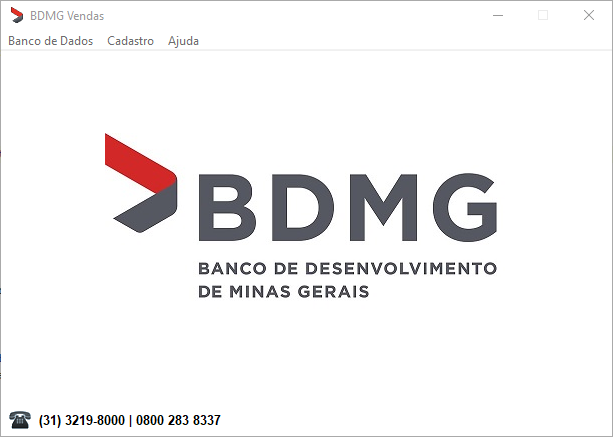
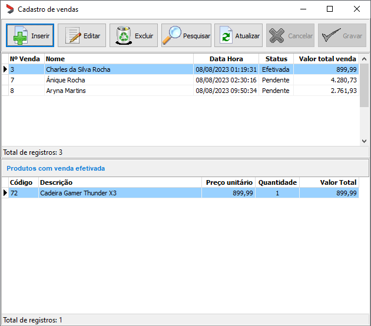
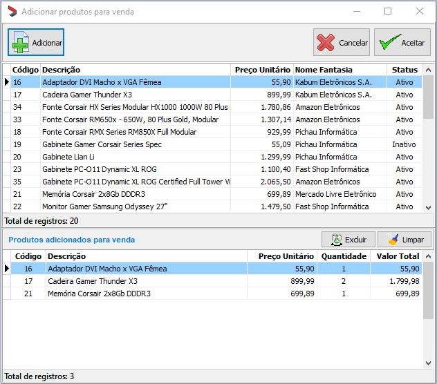

<h1 align="center">    
    
BDMG_Vendas

    
      
    
	  
    
</h1>

## Índice
- [Sobre](#-sobre)
- [Feramentas](#-ferramentas)
- [Funcionalidades](#-funcionalidades)
- [Licença](#-licença)

## 📘 Sobre

**Teste prático para programador Delphi BDMG**, sistema de cadastros e vendas.

## 🛠 Ferramentas

- [Delphi XE7](https://www.embarcadero.com/br/)
- [Delphi Horse](https://github.com/HashLoad/horse)
- [SQL Server](https://www.microsoft.com/pt-br/sql-server/sql-server-2019)
- [Git](https://git-scm.com/)
- [Tortoise Git](https://tortoisegit.org/)
- [Visual Studio Code](https://code.visualstudio.com/)

## 💡 Funcionalidades

- **Banco de Dados/Configurar...**: Abre a tela de configuração do arquivo **bdmg_config.ini**. Esse arquivo deve ficar na pasta onde é rodado o programa **Servidor.exe**.

- **Cadastro de clientes**: Tela para cadastro dos **clientes** que será necessário para realizar uma **venda**.

- **Cadastro de fornecedores**: Tela para cadastro dos **fornecedores** que será necessário para cadastrar **produtos**.

- **Cadastro de produtos**: Tela para cadastro dos **produtos** que será necessário para realizar uma **venda**.

- **Cadastro de vendas**: Tela para cadastro das **vendas** onde é possível selecionar os **clientes** e **produtos** para a realização da **venda**.

## 📄 Licença

Esse software é **free** e foi construído para realizar o **Teste prático para programador Delphi BDMG**.
